# PWN 

## Baby_Js 

### Description

nc 103.145.226.170 3003 
Author : Mockingjay 

### Technical Report 

Dari Description disebutkan didapatkan file yang dinamakan _chall_peserta.js_ lalu dari file tersebut dapat dicoba untuk memasukkan password yaitu seperti dibawah ini.

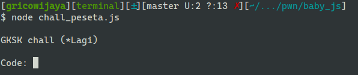

Lalu saya mendapat referensi dari web ini https://fadec0d3.blogspot.com/2018/04/midnight-sun-ctf-quals-2018-babyshells.html sehingga dari web tersebut akan menggunakan input padding yang dimana dari referensi dibawah ini 

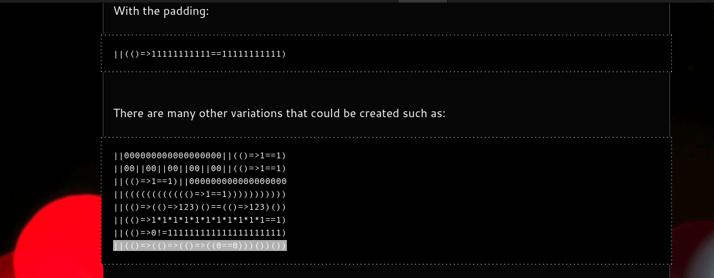

Dari beberapa contoh inputan diatas yang paling bawah sehingga nantinya percobaan tersebut akan mengembalikan "Go To Server Fast!!!" seperti gambar dibawah ini. Lalu dari netcat 103.145.226.170 3003 dapat didapatkan dari inputan ||(()=>(()=>(()=>((0==0)))())()) adalah flag yang dimana **GKSK22{S1ap4_B1l4ng_buat_so4l_pwn_g4b1s4_p4k3k_js}**

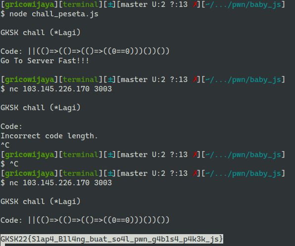

### Flag

GKSK22{S1ap4_B1l4ng_buat_so4l_pwn_g4b1s4_p4k3k_js}

# Forensics

## Sniff Sniff

### Description

Bjyr serverku diserang hacker, tolong cari tau apa password yg di curi oleh si hacker!!! fast!!!!

format flag : GKSK{}

author: Mockingjay

### Technical Report  

Dalam Challenge ini saya melakukan download untuk file log.cap tersebut yang dimana merupakan file yang log dari sebuah server yang dimana nantinya digunakan untuk melihat bahwa terdapat sebuah _bruteforce_ seperti dibawah ini 

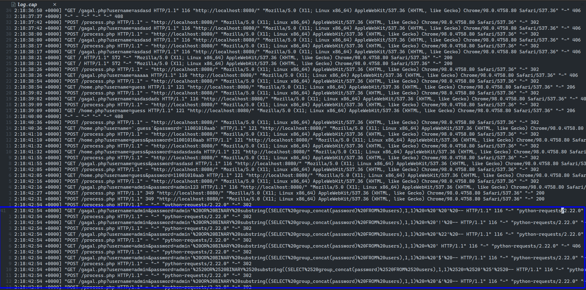

Dari analisa diatas terdapat sebuah pola yang dimana jika proses pencarian password dari user itu berhasil maka akan redirect ke GET /home.php maka dari saya menggunakan piping yang dimana melakukan cat log.cap dengan grep "GET /home" lalu disimpan pada file possible_flag.txt 

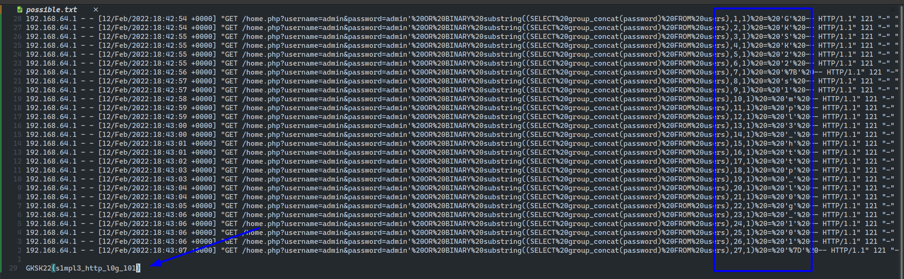

Dari hal tersebut dapat disusun karakter-karakter yang berhasil di brute-force pada log.cap tersebut sehingga menemukan flag __GKSK22{s1mpl3_http_l0g_101}__

### Flag

GKSK22{s1mpl3_http_l0g_101}

# Reverse Engineering

## ez_rev 

### Description

Gtw mau kasi desc apa kak h3h3h3h3
Coba aja

author : Mockingjay

### Technical Report 

Dalam Challenge ini dapat didapatkan sebuah file chall yang jika dijalankan akan seperti gambar dibawah ini.

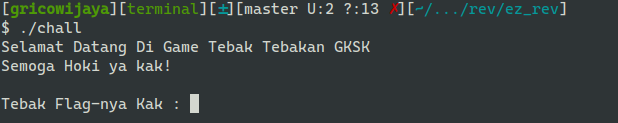

Jika salah maka akan mengembalikan kata "Salah Kak \n bye-bye!" seperti dibawah ini.

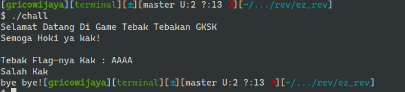

Maka dari itu dibutuhkan sebuah decompiler dengan menggunakan IDA Pro yang dimana nantinya akan mengembalikan sebuah fungsi-fungsi, dan terdapat sebuah fungsi yang menyimpan array yang dinamakan v6 dengan menggunakan tipe data int, sehingga saya berasumsi untuk array tersebut menyimpan karakter-karakter yang nantinya dapat akan dilakukan xor dengan binary hex 0x10 jika pada desimal adalah 16.

        
    __int64 __fastcall main(__int64 a1, char **a2, char **a3)
    {
      int i; // [rsp+8h] [rbp-118h]
      int j; // [rsp+Ch] [rbp-114h]
      int v6[52]; // [rsp+10h] [rbp-110h]
      char v7[56]; // [rsp+E0h] [rbp-40h] BYREF
      unsigned __int64 v8; // [rsp+118h] [rbp-8h]

      v8 = __readfsqword(0x28u);
      v6[0] = 87;
      v6[1] = 91;
      v6[2] = 67;
      v6[3] = 91;
      v6[4] = 34;
      v6[5] = 34;
      v6[6] = 107;
      v6[7] = 117;
      v6[8] = 106;
      v6[9] = 79;
      v6[10] = 98;
      v6[11] = 35;
      v6[12] = 102;
      v6[13] = 79;
      v6[14] = 114;
      v6[15] = 101;
      v6[16] = 100;
      v6[17] = 79;
      v6[18] = 99;
      v6[19] = 100;
      v6[20] = 98;
      v6[21] = 33;
      v6[22] = 96;
      v6[23] = 96;
      v6[24] = 35;
      v6[25] = 116;
      v6[26] = 79;
      v6[27] = 0x72;
      v6[28] = 33;
      v6[29] = 126;
      v6[30] = 79;
      v6[31] = 125;
      v6[32] = 113;
      v6[33] = 123;
      v6[34] = 35;
      v6[35] = 79;
      v6[36] = 33;
      v6[37] = 100;
      v6[38] = 79;
      v6[39] = 124;
      v6[40] = 127;
      v6[41] = 32;
      v6[42] = 123;
      v6[43] = 99;
      v6[44] = 79;
      v6[45] = 120;
      v6[46] = 36;
      v6[47] = 98;
      v6[48] = 116;
      v6[49] = 35;
      v6[50] = 98;
      v6[51] = 109;
      ((void (__fastcall *)(__int64, char **, char **))((char *)&sub_11A8 + 1))(a1, a2, a3);
      printf("\n\nTebak Flag-nya Kak : ");
      __isoc99_scanf("%s", v7);
      for ( i = 0; v7[i]; ++i )
        ;
      for ( j = 0; j < i; ++j )
      {
        if ( (char)(v7[j] ^ 0x10) != v6[j] )
        {
          puts("Salah Kak");
          break;
        }
        puts("Selamat Kak");
      }
      printf("bye bye!");
      return 0LL;
    }

Dari hal tersebut saya hanya membuat file exploitation dengan bahasa c ynag dimana digunakan untuk mengubah setiap integer lalu dibuat xor dengan bilangan 16 lalu dilakukan typecast menjadi character seperti dibawah ini.

    #include <stdio.h>

    int main() { 

      int v6[52];

      v6[0] = 87;
      v6[1] = 91;
      v6[2] = 67;
      v6[3] = 91;
      v6[4] = 34;
      v6[5] = 34;
      v6[6] = 107;
      v6[7] = 117;
      v6[8] = 106;
      v6[9] = 79;
      v6[10] = 98;
      v6[11] = 35;
      v6[12] = 102;
      v6[13] = 79;
      v6[14] = 114;
      v6[15] = 101;
      v6[16] = 100;
      v6[17] = 79;
      v6[18] = 99;
      v6[19] = 100;
      v6[20] = 98;
      v6[21] = 33;
      v6[22] = 96;
      v6[23] = 96;
      v6[24] = 35;
      v6[25] = 116;
      v6[26] = 79;
      v6[27] = 0x72;
      v6[28] = 33;
      v6[29] = 126;
      v6[30] = 79;
      v6[31] = 125;
      v6[32] = 113;
      v6[33] = 123;
      v6[34] = 35;
      v6[35] = 79;
      v6[36] = 33;
      v6[37] = 100;
      v6[38] = 79;
      v6[39] = 124;
      v6[40] = 127;
      v6[41] = 32;
      v6[42] = 123;
      v6[43] = 99;
      v6[44] = 79;
      v6[45] = 120;
      v6[46] = 36;
      v6[47] = 98;
      v6[48] = 116;
      v6[49] = 35;
      v6[50] = 98;
      v6[51] = 109;

      for (int i = 0; i < 52; i++) {
        v6[i] = v6[i] ^ 16;
        printf("%c", (char)v6[i]);
      }
      
      return 0;
      
    }

Dari Kode program diatas maka dapat dilakukan compile dengan gcc dan setelah itu akan didapatkan flag seperti dibawah ini.

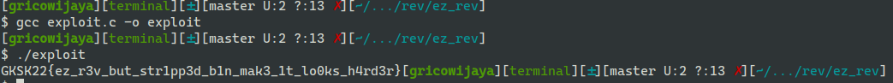

Kode program tersebut digunakan untuk melakukan looping sebanyak 52 kali dengan mengecek setiap array v6 dan setiap indeksnya dilakukan xor dengan bilangan 16 sehingga nantinya akan di typecast menjadi character lalu dilakukan outputnya.

### Flag 

GKSK22{ez_r3v_but_str1pp3d_b1n_mak3_1t_lo0ks_h4rd3r}

# Web

## Bomb

### Description

Bang bantu jinakin bomb nya bang...

http://103.145.226.170:1001/

Author : Mockingjay

### Technical Report

Dari Challenge ini dibutuhkan sebuah Aplikasi yaitu Burp Suite yang digunakan untuk melakukan pergantian request cookies response time seperti dibawah ini.

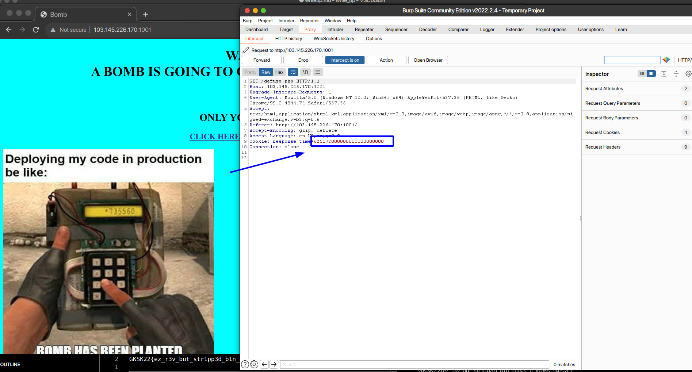

Dari hal tersebut nantinya akan melakukan forwarding kepada web yang diberikan setelah mengubah response time menjadi 0.

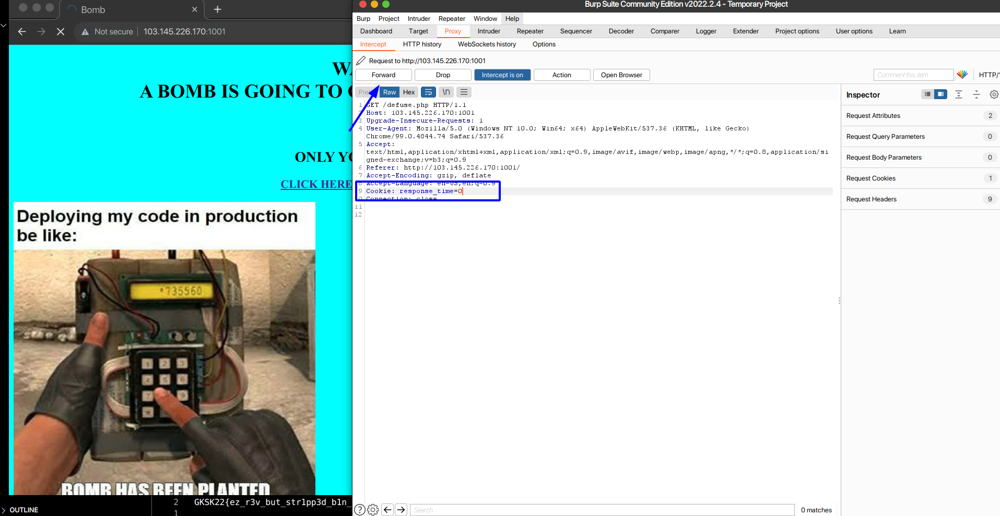

Lalu kita tekan butonn yang disediakan pada web tersebut sehingga akan mendapatkan flag yang diberikan karena defuse bomb tersebut diminta kurang dari 2 detik maka response time untuk cookies nya juga harus menjadi kurang dari 2 detik.

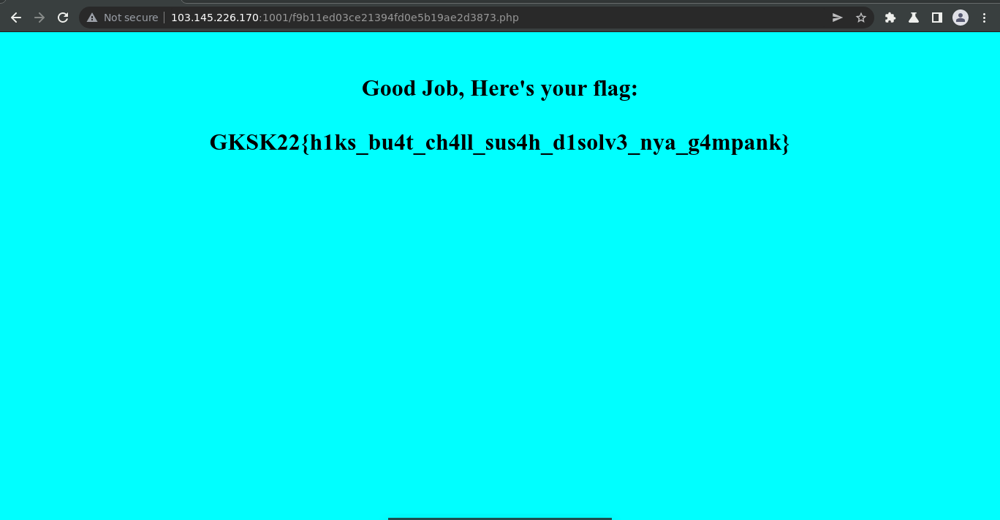

### Flag

GKSK22{h1ks_bu4t_ch4ll_sus4h_d1solv3_nya_g4mpank}

# Misc 

## Free?

### Description

Free?
10
Admin dan probset naro flag di platform ini, ayo tebak dimana?

Author : Mockingjay

### POC 

Dari hintnya diberikan pada bagian home dashboardnya dengan melakukan klik button dibawah ini.

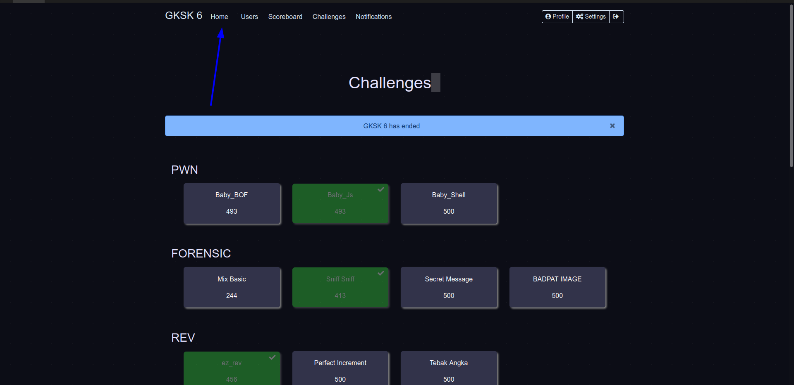

Tetap Jika dilihat pada home dashboardnya hanya terdapat sebuah format flag. 

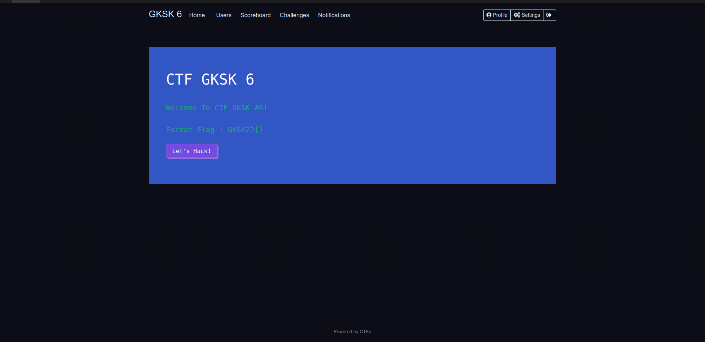

Maka dari itu saya coba melakukan inspect code dengan melakukan Ctrl+u pada browser saya dan terdapat comment yang menuliskan __GKSK22{Sebenernya_ini_free_flag_tapi_biar_gak_ez_aku_taro_disini_aja_h3h3h3h3} __ yang dituliskan pada line 99 seperti dibawah ini.

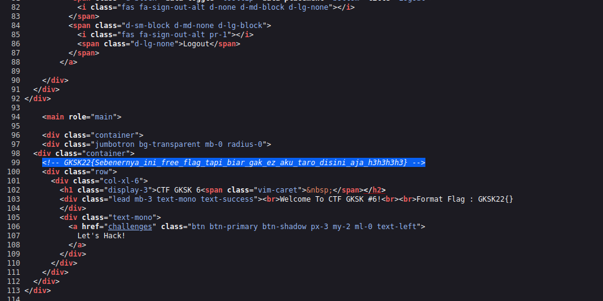

### Flag
GKSK22{Sebenernya_ini_free_flag_tapi_biar_gak_ez_aku_taro_disini_aja_h3h3h3h3}

# OSINT 

## Kota Rahasia 

### Description

Mimin dikasi alamat kota rahasia nihh
Kota ini berjarak sekitar
1496,7 km dari DARWIN,
2265,2 km dari HO CHI MINH ,
2204 km dari MANILA ,
Tolong bantu cariin kotanya dong !

*Format flag : Flag ditulis UPPERCASE : GKSK22{NAMA KOTA}
Contoh : GKSK22{KONOHA}

Author : Little_Krisna

### POC 

OSINT ini digunakan untuk melakukan sebuah pencarian lokasi, karena diberikan 3 kota dengan beberapa jarak maka saya akan gunakan sebuah metode untuk membuat sebuah radius lingkaran dari setiap jarak yang diberikan. Nantinya kemungkinan dari jarak-jarak tersebut akan mendapat sebuah 1 titik silang atau titik temu dari 3 radius tersebut. Untuk hal itu saya dapat menggunakan web ini dalam mebuat radius tersebut. https://www.mapdevelopers.com/draw-circle-tool.php 

Untuk yang pertama maka saya mengetikan Darwin beserta dengan jarak radiusnya yaitu 1496,7 km sehingga akan terlihat seperti dibawah ini.

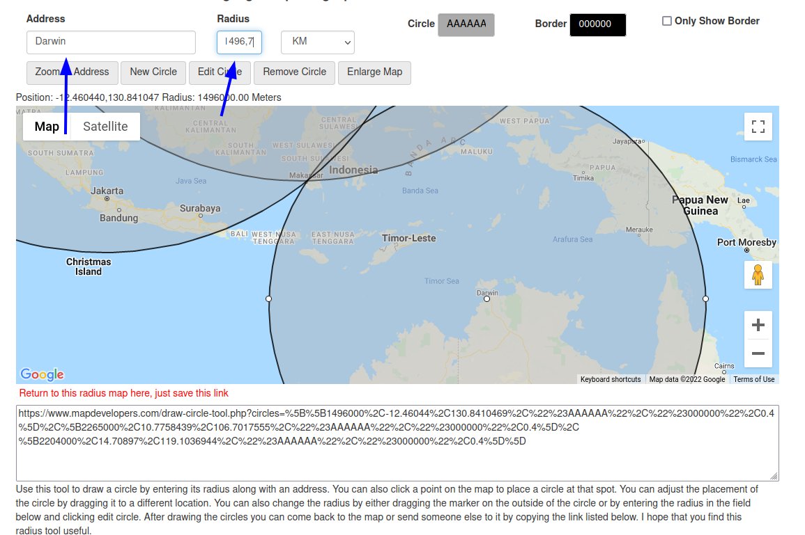

Untuk Radius yang kedua maka saya mengetikan Ho Chi Minh City dengan radius 2265,2 km sehingga nantinya akan terlihat seperti dibawah ini.

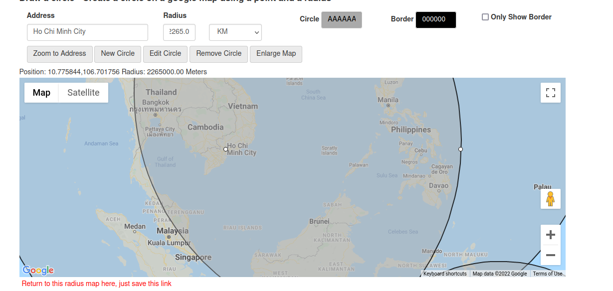

Untuk Radius yang kedua maka saya mengetikan Manila dengan radius 2204 km sehingga nantinya akan terlihat seperti dibawah ini.

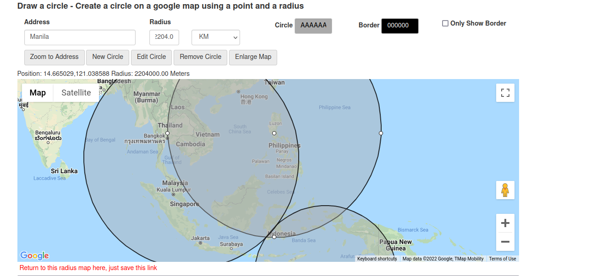

Jadi setelah ketiga lingkaran tersebut sudah terbuat maka nantinya akan terdapat titik yang dimana ketika lingkaran tersebut bertemu seperti _intersection_, dapat dilihat pada gambar dibawah ini.

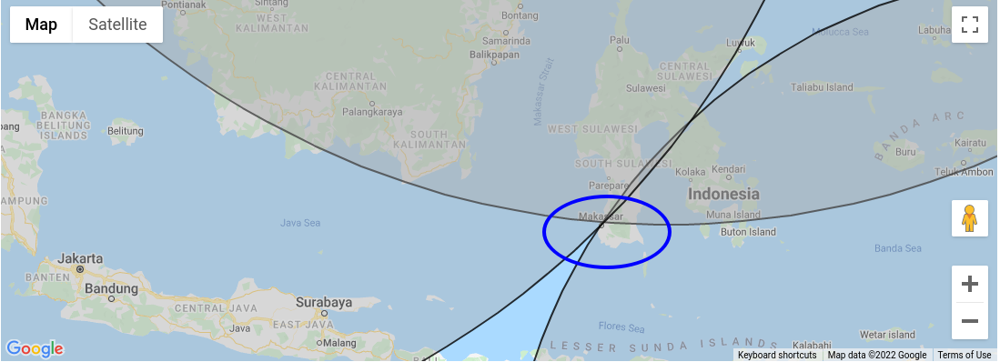

dari titik tersebut lah saya mencoba untuk menginput file yang dimana sesuai dengan format flag adalah GKSK22{NAMA KOTA} dengan uppercase sehingga flag diterima yaitu GKSK22{MAKASSAR}

### Flag

GKSK22{MAKASSAR}